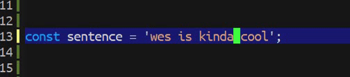

[](https://www.gnu.org/licenses/gpl-3.0)

# toggle-quotes-plus
> Simple quote toggler that cycle through " ' and `

[](https://github.com/jcs-elpa/toggle-quotes-plus/actions/workflows/test.yml)

<p align="center">
  
</p>

This is much of the universal solution, it just simply toggle and cycle through the 
`quotes` you specify under `toggle-quotes-plus-chars` list in any file. 

This package search for the character that can be cycled in both `backward` and 
`forward` directions. The original `toggle-quotes` will only works in string so 
it will not work in `.html` or `.md` file type. 

For escape character, I couldn't figure out the best way to resolve this. Currently, 
this package will just ignore the escape character. If you have an idea to solve this 
you can open an `issue` or `pull request`, both methods are welcome.

*P.S. Inspired by [Toggle Quotes](https://marketplace.visualstudio.com/items?itemName=BriteSnow.vscode-toggle-quotes) from VS Code Marketplace.* <br/>
*P.S. Similar package [toggle-quotes](https://github.com/toctan/toggle-quotes.el) by [Tian, Jin](https://github.com/toctan).*

## Usage

Call it from minibuffer directly,

```
M-x toggle-quotes-plus
```

Or you can bind it globally to any key you want.

```el
(global-set-key (kbd "C-'") #'toggle-quotes-plus)
```

## Configurations

Configure the list of character you want to cycle through.

```el
(setq toggle-quotes-plus-chars '("\""
                                 "'"
                                 "`"))
```

## Contribute

[](http://makeapullrequest.com)
[](https://github.com/bbatsov/emacs-lisp-style-guide)
[](https://www.paypal.me/jcs090218)
[](https://www.patreon.com/jcs090218)

If you would like to contribute to this project, you may either 
clone and make pull requests to this repository. Or you can 
clone the project and establish your own branch of this tool. 
Any methods are welcome!
